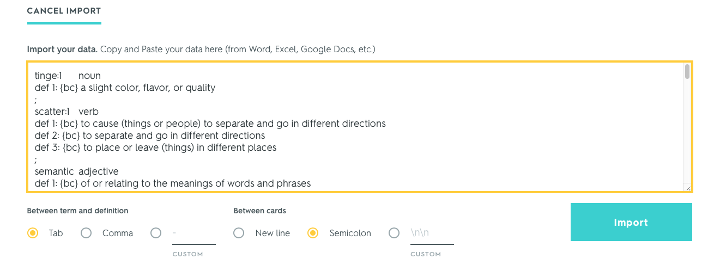

This repository is under MIT License. Details of the license please refer to the last section of this file.
# Vocabulary Auto-Lookup Program with Marriam-Webster Learner's Dictionary
## Introduction 
If you love to memorize vocabulary with flashcard app, just like me, this program may help you to create the useful flashcards. You may notice the auto-generated definitions from the app are unfriendly to non-native learner. In contrast, I feel good with Marriam-Webster Learner's Dictionary which I think is one of the best dictionary for English learners. As this reason, I wrote this program to help myself create flashcards with good definitions effortlessly.

You can put all unfamiliar words together in a text file (vocabulary builder on kindle + kindle mate software do this very well), then use this program to generate the definitions of the words. Finally, import those words with definitions to your favorite flashcard app!
## Summary
The program reads words from input text file you've provided, then generates the definitions of the words to help you create your flashcards.
## Requirement
1. [Python 3](https://www.python.org)
2. [Merriam-Webster Learner's Dictionary API Key](https://dictionaryapi.com)
## Input file format
I use [kindle mate](https://kmate.me) as a tool to export my vocabulary builder data from my kindle paperwhite. The exported file has format like below. You don't have to use the same tool as me, but make sure you follow this format.
```
wordA
wordB
wordC
...
wordLast
```
## Output file format
The program will read each line in input file then look up the vocabulary and output with following format:
```
Word1 FunctionLabel
Def1
Def2  
...
;
Word2 FunctionLabel
Def1
Def2
...
;
```
> Noted that the keyword and its function label are seperated by a tab character (\t). Other elements are seperated by new line characters (\n).
## How to use
1. Replace your key in credentials.py file.
   ```python
   key = 'input-your-key-here'
   ``` 
2. In terminal, change directory to this repository directory.
3. Use ```python3``` to run the program.
   ```bash
   python3 Main.py
   ```
   1. Provide the file that contains vocabulary you want to look up.
   ```
   Enter the file contains vocabularies: book1.txt
   ```
   > Be aware that you should put the file in the same directory or provide absolute path.
   2. Wait until program terminated.
   3. Open the file starting with *DefAdded_* to check result.
4. Or you can use command line argument to address your file. like below example.
   ```bash
   python3 Main.py book1.txt book2.txt
   ```
5. In your favorite flashcard app, import the file just created by the program and set semicolon (;) as card-seperated character.
    
    *Quizlet*
    
    
## Known issue
1. Some past-tense vocabularies couldn't be found.
2. There're special marks ```{bc}``` in definition.
# License
MIT License

Copyright (c) 2019 Chun-Hung Brian Liu

Permission is hereby granted, free of charge, to any person obtaining a copy
of this software and associated documentation files (the "Software"), to deal
in the Software without restriction, including without limitation the rights
to use, copy, modify, merge, publish, distribute, sublicense, and/or sell
copies of the Software, and to permit persons to whom the Software is
furnished to do so, subject to the following conditions:

The above copyright notice and this permission notice shall be included in all
copies or substantial portions of the Software.

THE SOFTWARE IS PROVIDED "AS IS", WITHOUT WARRANTY OF ANY KIND, EXPRESS OR
IMPLIED, INCLUDING BUT NOT LIMITED TO THE WARRANTIES OF MERCHANTABILITY,
FITNESS FOR A PARTICULAR PURPOSE AND NONINFRINGEMENT. IN NO EVENT SHALL THE
AUTHORS OR COPYRIGHT HOLDERS BE LIABLE FOR ANY CLAIM, DAMAGES OR OTHER
LIABILITY, WHETHER IN AN ACTION OF CONTRACT, TORT OR OTHERWISE, ARISING FROM,
OUT OF OR IN CONNECTION WITH THE SOFTWARE OR THE USE OR OTHER DEALINGS IN THE
SOFTWARE.
